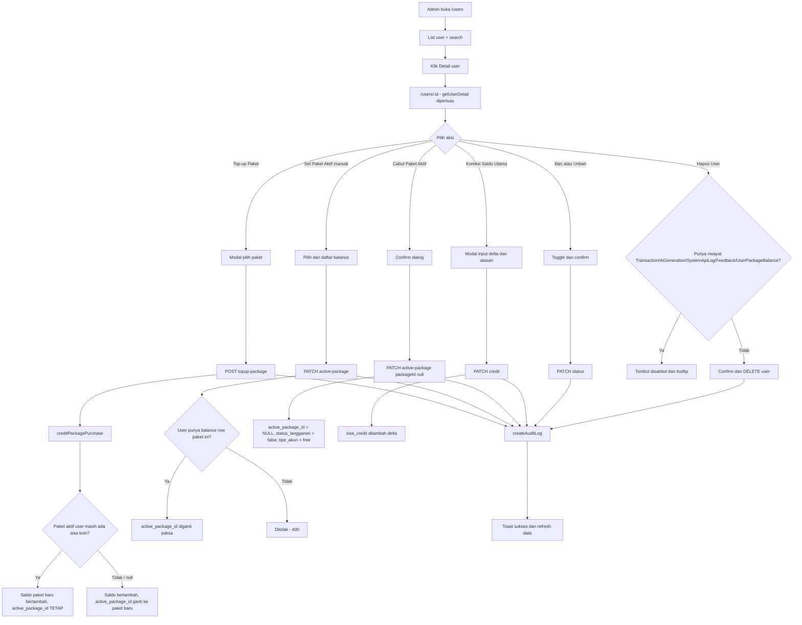
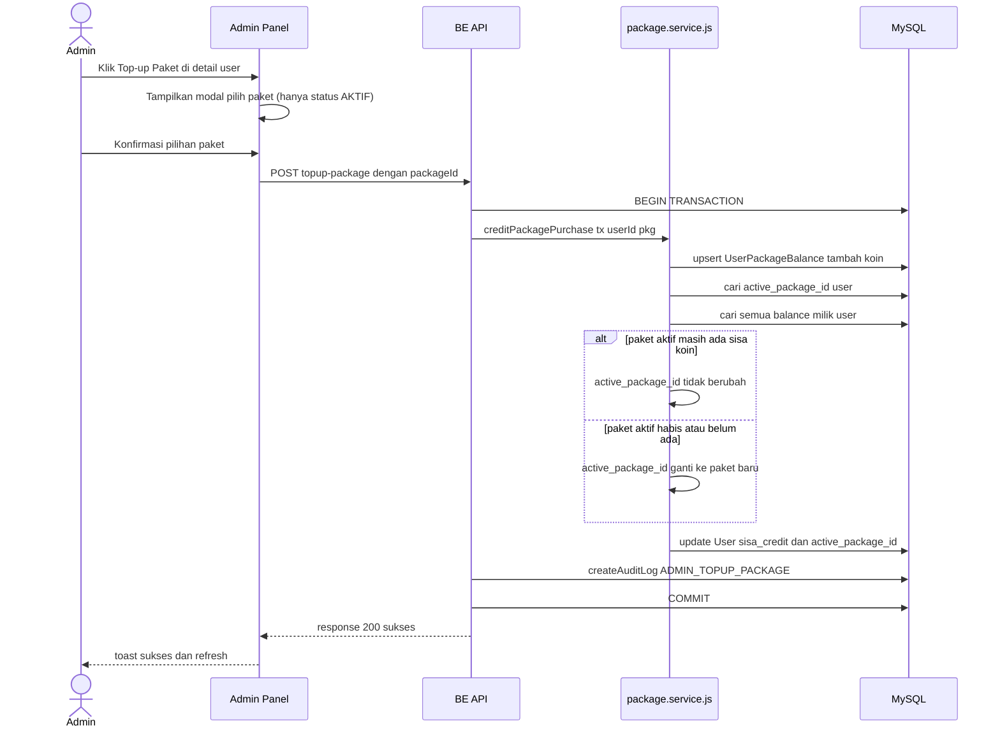
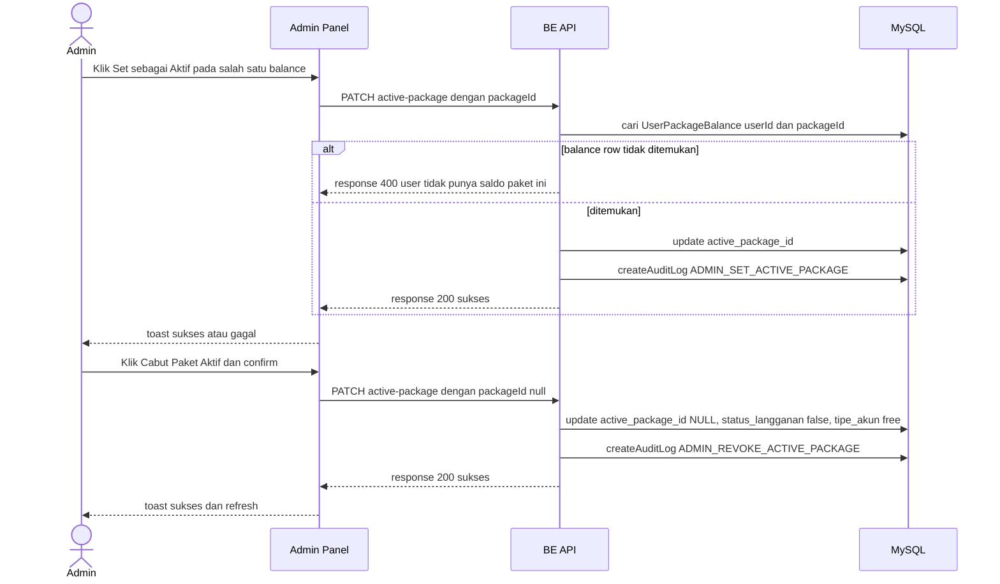

# Admin: Manajemen User & Subscription

## Problem

Admin tidak punya cara untuk mengelola subscription/koin user secara langsung dari panel admin. Skenario nyata yang sering terjadi:

1. User komplain sudah bayar tapi paketnya belum aktif (webhook payment gateway gagal/telat).
2. Perlu koreksi koin (refund/kompensasi) karena kesalahan sistem atau kebijakan customer service.
3. Investigasi status subscription user tertentu (paket aktif, saldo per-paket, riwayat transaksi) saat ada laporan masalah.
4. Downgrade/cabut paket user karena fraud atau chargeback.

Backend sudah punya sebagian endpoint untuk ini (`GET /admin/users`, `GET /admin/users/:id`, `PATCH /admin/users/:id/credit`, `PATCH /admin/users/:id/status`, `DELETE /admin/users/:id`) tapi **tidak ada satupun UI frontend yang memakainya**. Endpoint-endpoint ini juga belum punya kemampuan terkait paket/subscription (ganti paket aktif, lihat saldo per-paket).

## Goals

- Admin bisa lihat daftar semua user + cari berdasarkan nama/email.
- Admin bisa lihat detail satu user: info akun, paket aktif, saldo per-paket, riwayat transaksi, riwayat AI generation.
- Admin bisa top-up koin untuk paket tertentu ke user (simulasi pembelian, untuk kasus "sudah bayar tapi belum aktif").
- Admin bisa force-set paket aktif user secara manual.
- Admin bisa cabut paket aktif user.
- Admin bisa koreksi `sisa_credit` user (delta +/-, dengan alasan).
- Admin bisa ban/unban user.
- Admin bisa hapus user — **hanya** untuk user tanpa riwayat data (lihat Edge Cases).
- Semua aksi mutasi tercatat di `AuditLog`.

## Out of scope

- Tidak mengubah cara `sisa_credit` dipakai oleh `billingNode` (tetap sumber kebenaran tunggal untuk billing).
- Tidak membuat "hard delete" yang cascade menghapus data riwayat user — keputusan eksplisit untuk keamanan data.
- Tidak ada bulk action (mass ban, mass top-up) — satu user per aksi.

## Arsitektur

Dua repo terlibat:
- **be-key-barbershop**: 2 endpoint baru + 1 endpoint diperluas (`getUserDetail`), reuse 3 endpoint admin yang sudah ada.
- **fe-key-barbershop**: 2 halaman baru (`/users` list, `/users/[id]` detail), 1 menu sidebar baru "User & Subscription" (posisi setelah "Harga & Langganan").

### Flow keseluruhan



### Sequence: Top-up Paket



### Sequence: Set Paket Aktif & Cabut



## Backend changes (be-key-barbershop)

### 1. `getUserDetail` (extend) — `src/controllers/admin.controller.js`

Tambahkan ke `include`:
- `active_package: { select: { id: true, namaPaket: true } }`
- `package_balances: { include: { package: { select: { namaPaket: true, jumlahKoin: true } } }, orderBy: { purchased_at: "desc" } }`
- `transactions: { orderBy: { tgl_transaksi: "desc" }, take: 10 }`
- `_count: { select: { transactions: true, ai_generations: true, system_api_logs: true, feedbacks: true, package_balances: true } }` — dipakai FE untuk validasi tombol Hapus User (disabled kalau salah satu count > 0).

### 2. `POST /admin/users/:id/topup-package` (baru)

- Body: `{ packageId: string }`.
- Validasi: `packageId` ditemukan dan aktif — lihat aturan lengkap di "Edge cases & validasi" bagian Top-up paket nonaktif.
- Implementasi: `prisma.$transaction(async (tx) => { const pkg = await tx.subscriptionPackage.findUnique(...); await creditPackagePurchase(tx, userId, pkg); })` — reuse helper dari `src/services/package.service.js` (sudah ada dari Fix 2 sebelumnya, tidak diubah).
- `createAuditLog(adminId, "ADMIN_TOPUP_PACKAGE", userId, { packageId, koin: pkg.jumlahKoin }, req)`.
- Response: `{ sisa_credit, active_package_id }`.

### 3. `PATCH /admin/users/:id/active-package` (baru)

- Body: `{ packageId: string | null }`.
- Jika `packageId` bukan null: validasi `prisma.userPackageBalance.findUnique({ where: { user_id_package_id: { user_id: id, package_id: packageId } } })` ada (pakai `@@unique([user_id, package_id])` yang sudah ada di schema). Tidak ada syarat `coins_remaining > 0` — admin punya kontrol penuh, billing engine sudah menangani kasus koin habis secara natural.
- Jika `packageId` null (cabut): update `active_package_id: null, status_langganan: false, tipe_akun: "free"` — supaya konsisten dengan `creditPackagePurchase` yang set `status_langganan: true, tipe_akun: "premium"` saat aktivasi. Tanpa ini, user akan punya `active_package_id = null` tapi tetap tercatat `tipe_akun: "premium"`, status yang tidak konsisten.
- Jika `packageId` diisi: update `active_package_id: packageId` saja (tidak mengubah `status_langganan`/`tipe_akun`, karena admin secara eksplisit memilih paket yang user sudah punya balance-nya — kondisi tipe_akun/status_langganan dianggap sudah benar dari pembelian sebelumnya).
- `createAuditLog(adminId, packageId ? "ADMIN_SET_ACTIVE_PACKAGE" : "ADMIN_REVOKE_ACTIVE_PACKAGE", userId, { packageId }, req)`.

### 4. Reuse dengan perubahan minor

**`PATCH /admin/users/:id/credit` (`adjustCredit`)** — dipakai untuk "Koreksi Saldo Utama". Satu baris perubahan di `src/controllers/admin.controller.js`: baca `req.body.reason` (opsional, tidak ada validasi wajib) dan sertakan ke `details` saat memanggil `createAuditLog`:

```js
await createAuditLog(req.user.id, "ADJUST_CREDIT", user.id, { delta, new_credit: user.sisa_credit, reason: req.body.reason }, req);
```

Tidak ada perubahan lain pada endpoint ini.

### 5. Reuse tanpa perubahan

- `PATCH /admin/users/:id/status` (`updateUserStatus`) — ban/unban, tidak berubah.
- `DELETE /admin/users/:id` (`deleteUser`) — tidak berubah. FE yang mencegah klik kalau user punya riwayat (lihat Edge Cases). Kalau tetap gagal di backend (race condition: history baru masuk setelah FE load), pesan FK error dari Prisma diteruskan sebagai toast error oleh `sendError` (sudah ada).

## Frontend changes (fe-key-barbershop)

### Sidebar — `src/app/(admin)/layout.jsx`

Tambah ke array `navigation`, setelah entry "Harga & Langganan":
```js
{ name: "User & Subscription", href: "/users", icon: Users }
```
(`Users` icon sudah diimport untuk menu "Barbers" — pakai icon lain yang belum dipakai, misal `UserCog`, supaya tidak duplikat ikon di sidebar.)

### Service — `src/services/userManagementService.js` (baru)

```js
export const userManagementService = {
  getUsers: (params) => api.get("/admin/users", { params }),
  getUserDetail: (id) => api.get(`/admin/users/${id}`),
  topupPackage: (id, packageId) => api.post(`/admin/users/${id}/topup-package`, { packageId }),
  setActivePackage: (id, packageId) => api.patch(`/admin/users/${id}/active-package`, { packageId }),
  adjustCredit: (id, amount, reason) => api.patch(`/admin/users/${id}/credit`, { amount, reason }),
  updateStatus: (id, is_banned) => api.patch(`/admin/users/${id}/status`, { is_banned }),
  deleteUser: (id) => api.delete(`/admin/users/${id}`),
};
```

### Page list — `src/app/(admin)/users/page.jsx` (baru)

Mengikuti pola tabel yang sudah ada di `langganan/page.jsx` (style Tailwind, warna `#4a1a1a`/`#8b6f66`, dst):
- Search input (nama/email) — debounce 400ms, panggil ulang `getUsers({ search, page })`.
- Tabel kolom: Nama, Email, Tipe Akun, Status Langganan, Sisa Credit, Status (badge AKTIF/BANNED dari `is_banned`), Aksi (tombol "Detail" → `router.push(/users/${id})`).
- Pagination sederhana (page/limit, mengikuti meta dari response).

### Page detail — `src/app/(admin)/users/[id]/page.jsx` (baru)

Sections:
1. **Info User** — nama, email, role, tipe_akun, createdAt, badge ban + tombol toggle ban/unban (confirm dialog, pakai `showConfirm` dari `useToast`).
2. **Paket Aktif** — nama paket aktif atau "Tidak ada paket aktif", tombol "Cabut Paket Aktif" (disabled kalau sudah null).
3. **Saldo per Paket** — tabel dari `package_balances`: nama paket, coins_remaining, coins_purchased, purchased_at. Tiap baris ada tombol "Set sebagai Aktif" (disabled kalau sudah jadi paket aktif saat ini). Di atas tabel, tombol "Top-up Paket" → modal pilih paket (fetch packages aktif dari `packageService.getPackages`, filter `status === "AKTIF"` di FE).
4. **Koreksi Saldo Utama** — tombol buka modal: input angka delta (boleh negatif) + textarea alasan (required) → `adjustCredit`.
5. **Riwayat Transaksi** — tabel read-only dari `transactions` (10 terakhir).
6. **Riwayat AI Generation** — tabel read-only dari `ai_generations` (sudah ada datanya dari `getUserDetail`, 10 terakhir).
7. **Zona Bahaya** — tombol "Hapus User", disabled (dengan tooltip alasan) kalau salah satu dari `_count.transactions`, `_count.ai_generations`, `_count.system_api_logs`, `_count.feedbacks`, `_count.package_balances` > 0. Kalau semua 0, tombol aktif + confirm dialog tegas ("aksi tidak bisa dibatalkan").

Semua modal mengikuti pola modal yang sudah ada di `langganan/page.jsx` (state `isModalOpen`/`formData`, toast via `useToast`).

## Edge cases & validasi

- **Top-up paket nonaktif**: ditolak 400 dengan pesan jelas. Validasi memeriksa DUA kondisi (mirror dari `isPackageActive` di `getAllPackages`, tapi untuk satu paket saja sehingga tidak perlu bulk join ke `modelStatusMap`): (1) `subscriptionPackage.status === "AKTIF"`, DAN (2) `llmModel.isActive === true` (dan `imageModel.isActive === true` juga, kalau `featVirtualTryOn` true). Kalau salah satu gagal → 400.
- **Set paket aktif ke paket yang tidak dimiliki user**: ditolak 400, FE juga sudah membatasi pilihan hanya dari `package_balances` yang ada sehingga skenario ini hanya terjadi lewat API langsung (defense in depth, bukan jalur normal UI).
- **Race condition delete**: FE cek `_count` saat halaman dimuat: kalau user melakukan aksi lain (misal AI generation) di tab lain sebelum klik Hapus, backend tetap bisa gagal dengan FK error — ditangkap sebagai toast error, bukan crash.
- **Audit log untuk aksi admin terhadap admin lain**: `getUsers` sudah memfilter `role: "user"` sehingga halaman ini tidak akan menampilkan akun admin — tidak perlu guard tambahan untuk mencegah admin menghapus/membanned admin lain.

## Testing plan

Mengikuti konvensi `anti-boncos.test.js` (Jest + Supertest + JWT, HTTP request asli ke `app`, bukan panggil Prisma langsung di body test):

- `topup-package`: kredit ke user tanpa paket aktif → langsung aktif; kredit ke user dengan paket aktif yang masih ada sisa koin → paket aktif tidak berubah, balance baru tetap bertambah; topup paket yang `status NONAKTIF` → 400.
- `active-package`: set ke paket yang user punya balance-nya → 200, `active_package_id` berubah; set ke paket yang tidak dimiliki → 400; set ke `null` → `active_package_id` null + `status_langganan` false + `tipe_akun` free.
- `getUserDetail`: response menyertakan `active_package`, `package_balances`, `transactions`, dan `_count` yang benar.
- Non-admin token ke semua endpoint baru → 403 (sudah dijamin oleh `router.use(verifyToken, isAdmin)` di `admin.routes.js`, tes regresi saja).
